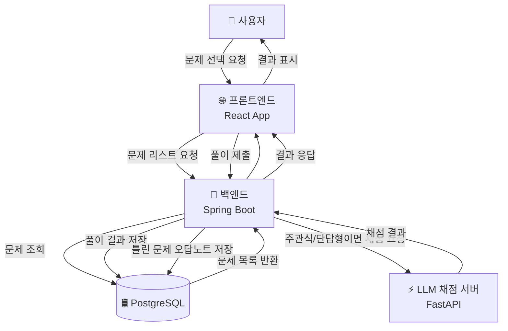
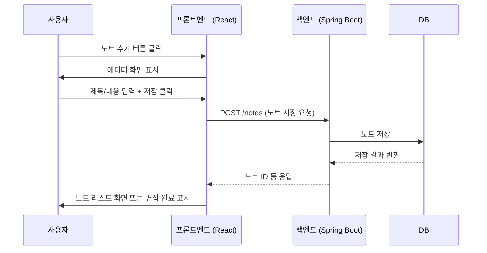
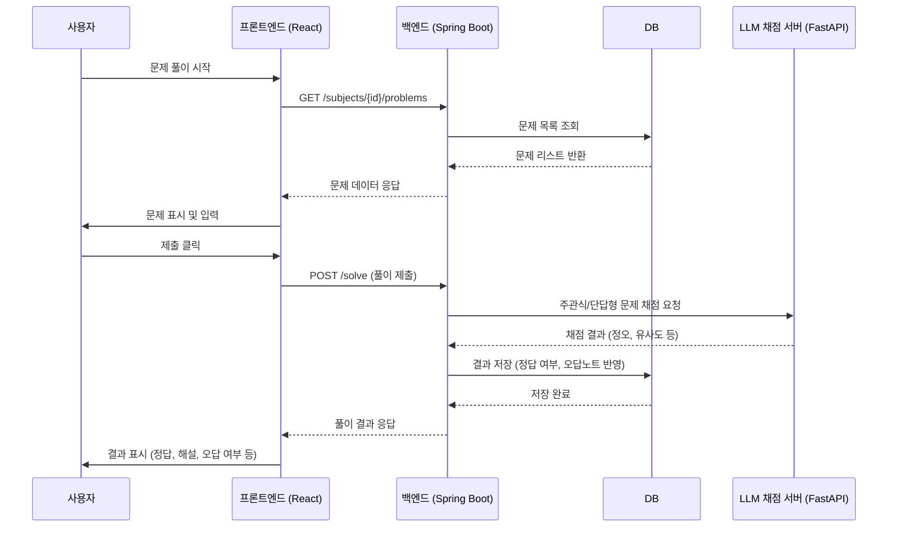

# 📦 StudyTrack 프로젝트 다이어그램 정리 (Architecture, DFD, Sequence)

---

## 🏗️ 시스템 아키텍처 다이어그램

### ✅ Mermaid 아키텍처 다이어그램

```mermaid
graph TD
    subgraph 사용자
        A[🧑 사용자 브라우저]
    end

    subgraph 프론트엔드 (React + Vite)
        B[🌐 React App<br/>(Vite + Zustand + Tailwind)]
    end

    subgraph 백엔드 (Kotlin + Spring Boot)
        C[🚀 Spring Boot API 서버<br/>(Kotlin, JPA, Swagger)]
        D[⚡ FastAPI LLM 서버<br/> (문제 채점 전용)]
    end

    subgraph 데이터베이스 (Docker)
        E[(🛢️ PostgreSQL DB)]
    end

    A --> B
    B -->|REST API 요청| C
    C -->|JPA/SQL 처리| E
    C -->|LLM 채점 요청| D
    D -->|채점 결과 응답| C
```

---

## 📘 아키텍처 설명

- 프론트엔드: React + Vite + Zustand + Tailwind
- 백엔드: Kotlin + Spring Boot + JPA + Swagger
- LLM 서버: FastAPI (주관식/단답형 문제 채점용)
- DB: PostgreSQL (Docker 기반)

---

# 🔄 DFD: 데이터 흐름 다이어그램

## 1️⃣ 문제 풀이 흐름 DFD



## 2️⃣ 노트 작성 흐름 DFD

```mermaid
flowchart TD
    User[🧑 사용자]
    FE[🌐 프론트엔드<br/>React App]
    BE[🚀 백엔드<br/>Spring Boot]
    DB[(🛢️ PostgreSQL)]

    User -->|노트 추가 버튼 클릭| FE
    FE -->|에디터 화면 렌더링| User
    User -->|노트 입력 및 저장 클릭| FE
    FE -->|POST /notes 요청| BE
    BE -->|노트 저장| DB
    DB -->|저장 성공| BE
    BE -->|응답 반환 (noteId 등)| FE
    FE -->|노트 리스트 또는 편집 화면 전환| User
```

## 3️⃣ 소셜 로그인 흐름 DFD

```mermaid
flowchart TD
    User[🧑 사용자]
    FE[🌐 프론트엔드<br/>React App]
    OAuth[🔑 OAuth 서버<br/>(Google/Naver/Kakao)]
    BE[🚀 백엔드<br/>Spring Boot]
    DB[(🛢️ PostgreSQL)]

    User -->|소셜 로그인 버튼 클릭| FE
    FE -->|OAuth 인증 요청| OAuth
    OAuth -->|액세스 토큰 전달| FE
    FE -->|POST /auth/oauth-login<br/>+ 액세스 토큰| BE
    BE -->|토큰 검증 및 사용자 조회| OAuth
    BE -->|신규 사용자면 저장| DB
    DB -->|저장 확인| BE
    BE -->|JWT 발급 + 사용자 정보 반환| FE
    FE -->|JWT 저장 후 메인 페이지 이동| User
```

---

# ⏱️ 시퀀스 다이어그램

## 1️⃣ 소셜 로그인


## 2️⃣ 노트 작성



## 3️⃣ 문제 풀이 + LLM 채점



---
