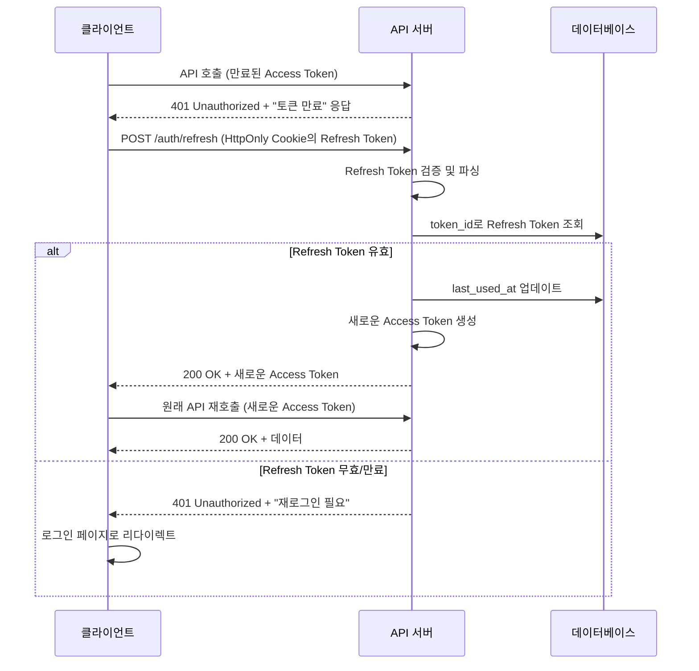
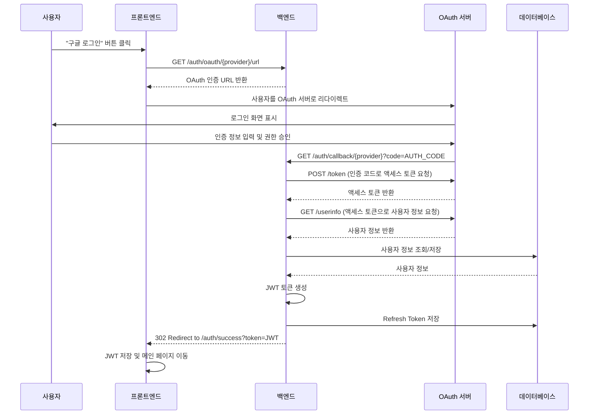

# 🔐 인증 시스템 상세 명세

---

## 📋 JWT 토큰 구조 및 Payload 스펙

### 1. Access Token 구조

**Header**
```json
{
  "alg": "HS256",
  "typ": "JWT"
}
```

**Payload**
```json
{
  "sub": "123e4567-e89b-12d3-a456-426614174000",
  "email": "user@example.com",
  "nickname": "사용자닉네임",
  "provider": "self",
  "roles": ["USER"],
  "iat": 1693747200,
  "exp": 1693750800,
  "iss": "studytrack-api",
  "aud": "studytrack-client"
}
```

**Payload 필드 설명**

| 필드 | 타입 | 설명 | 예시 |
|------|------|------|------|
| `sub` | String | 사용자 고유 ID (UUID) | `123e4567-e89b-12d3-a456-426614174000` |
| `email` | String | 사용자 이메일 | `user@example.com` |
| `nickname` | String | 사용자 닉네임 | `사용자닉네임` |
| `provider` | String | 로그인 제공자 (`self`, `google`, `naver`, `kakao`) | `self` |
| `roles` | Array<String> | 사용자 권한 목록 | `["USER"]` |
| `iat` | Number | 토큰 발급 시간 (Unix timestamp) | `1693747200` |
| `exp` | Number | 토큰 만료 시간 (Unix timestamp) | `1693750800` |
| `iss` | String | 토큰 발급자 | `studytrack-api` |
| `aud` | String | 토큰 대상 | `studytrack-client` |

### 2. Refresh Token 구조

**Payload**
```json
{
  "sub": "123e4567-e89b-12d3-a456-426614174000",
  "type": "refresh",
  "jti": "refresh_456e7890-f12g-34h5-i678-901234567890",
  "iat": 1693747200,
  "exp": 1696339200,
  "iss": "studytrack-api",
  "aud": "studytrack-client"
}
```

**Refresh Token 필드 설명**

| 필드 | 타입 | 설명 | 예시 |
|------|------|------|------|
| `sub` | String | 사용자 고유 ID | `123e4567-e89b-12d3-a456-426614174000` |
| `type` | String | 토큰 타입 (항상 `refresh`) | `refresh` |
| `jti` | String | Refresh Token 고유 ID (DB 저장용) | `refresh_456e7890-f12g-34h5-i678-901234567890` |
| `iat` | Number | 토큰 발급 시간 | `1693747200` |
| `exp` | Number | 토큰 만료 시간 (30일) | `1696339200` |

### 3. 토큰 만료 시간 정책

| 토큰 타입 | 만료 시간 | 용도 |
|-----------|----------|------|
| Access Token | **15분** | API 호출 인증 |
| Refresh Token | **30일** | Access Token 재발급 |

---

## 🔄 Refresh Token 저장 및 갱신 로직

### 1. Refresh Token 저장 위치

#### 백엔드 (DB 저장)
```sql
CREATE TABLE refresh_tokens (
  id uuid PRIMARY KEY,
  user_id uuid NOT NULL REFERENCES "user"(id) ON DELETE CASCADE,
  token_id varchar(255) NOT NULL UNIQUE, -- JWT의 jti 값
  token_hash varchar(255) NOT NULL,      -- Refresh Token의 해시값
  expires_at timestamp NOT NULL,
  created_at timestamp DEFAULT CURRENT_TIMESTAMP,
  last_used_at timestamp,
  is_revoked boolean DEFAULT false,
  device_info varchar(500),              -- User-Agent, IP 등
  
  INDEX idx_refresh_tokens_user_id (user_id),
  INDEX idx_refresh_tokens_token_id (token_id),
  INDEX idx_refresh_tokens_expires_at (expires_at)
);
```

#### 프론트엔드 (HttpOnly Cookie)
```javascript
// 로그인 성공 시 서버에서 설정
Set-Cookie: refreshToken=eyJhbGciOiJIUzI1NiIs...; 
            HttpOnly; 
            Secure; 
            SameSite=Strict; 
            Max-Age=2592000; 
            Path=/api/auth
```

### 2. 토큰 갱신 플로우

#### 시퀀스 다이어그램


### 3. Refresh Token 관리 정책

#### 보안 정책
- **Rotation 정책**: Refresh Token 사용 시 새로운 Refresh Token 발급 (선택적)
- **단일 기기 정책**: 사용자당 최대 5개의 활성 Refresh Token 허용
- **자동 정리**: 만료된 토큰은 배치 작업으로 주기적 삭제

#### API 명세: `POST /auth/refresh`

**Request**
- **Cookie**: `refreshToken=eyJhbGciOiJIUzI1NiIs...`

**Success Response (200 OK)**
```json
{
  "guid": "G2025090410300055",
  "resultCode": "00000",
  "resultMessage": "토큰 갱신 성공",
  "data": {
    "accessToken": "eyJhbGciOiJIUzI1NiIs...",
    "expiresIn": 900
  }
}
```

**Error Responses**
- `41002` 세션이 만료되었습니다 (Refresh Token 만료)
- `41004` 유효하지 않은 인증 정보입니다 (잘못된 토큰)

---

## 🌐 소셜 로그인 OAuth 플로우 및 Redirect URI

### 1. OAuth 제공자별 설정

#### Google OAuth 2.0
```yaml
# application.yml
oauth:
  google:
    client-id: ${GOOGLE_CLIENT_ID}
    client-secret: ${GOOGLE_CLIENT_SECRET}
    redirect-uri: ${BASE_URL}/auth/callback/google
    scope: openid,email,profile
    authorization-uri: https://accounts.google.com/o/oauth2/v2/auth
    token-uri: https://oauth2.googleapis.com/token
    user-info-uri: https://www.googleapis.com/oauth2/v2/userinfo
```

#### Naver OAuth 2.0
```yaml
oauth:
  naver:
    client-id: ${NAVER_CLIENT_ID}
    client-secret: ${NAVER_CLIENT_SECRET}
    redirect-uri: ${BASE_URL}/auth/callback/naver
    scope: name,email
    authorization-uri: https://nid.naver.com/oauth2.0/authorize
    token-uri: https://nid.naver.com/oauth2.0/token
    user-info-uri: https://openapi.naver.com/v1/nid/me
```

#### Kakao OAuth 2.0
```yaml
oauth:
  kakao:
    client-id: ${KAKAO_CLIENT_ID}
    client-secret: ${KAKAO_CLIENT_SECRET}
    redirect-uri: ${BASE_URL}/auth/callback/kakao
    scope: profile_nickname,account_email
    authorization-uri: https://kauth.kakao.com/oauth/authorize
    token-uri: https://kauth.kakao.com/oauth/token
    user-info-uri: https://kapi.kakao.com/v2/user/me
```

### 2. 소셜 로그인 플로우

#### 전체 시퀀스 다이어그램


### 3. API 명세

#### `GET /auth/oauth/{provider}/url`
**설명**: OAuth 인증 URL 생성
**Path Parameters**: `provider` - `google`, `naver`, `kakao`

**Success Response**
```json
{
  "guid": "G2025090410300066",
  "resultCode": "00000",
  "resultMessage": "OAuth URL 생성 성공",
  "data": {
    "authUrl": "https://accounts.google.com/o/oauth2/v2/auth?client_id=...&redirect_uri=...&scope=...&response_type=code&state=random_state"
  }
}
```

#### `GET /auth/callback/{provider}`
**설명**: OAuth 콜백 처리 (서버 간 통신)
**Query Parameters**: 
- `code`: OAuth 인증 코드
- `state`: CSRF 방지용 상태값

**Success Response**: `302 Redirect to /auth/success?token=JWT_TOKEN`
**Error Response**: `302 Redirect to /auth/error?message=ERROR_MESSAGE`

### 4. 환경별 Redirect URI 설정

| 환경 | Base URL | Redirect URI |
|------|----------|--------------|
| 로컬 | `http://localhost:8080` | `http://localhost:8080/auth/callback/{provider}` |
| 개발 | `https://dev.studytrack.com` | `https://dev.studytrack.com/auth/callback/{provider}` |
| 운영 | `https://studytrack.com` | `https://studytrack.com/auth/callback/{provider}` |

### 5. 보안 고려사항

- **State Parameter**: CSRF 공격 방지를 위한 랜덤 상태값 사용
- **HTTPS 필수**: 운영 환경에서는 반드시 HTTPS 사용
- **Redirect URI 검증**: 등록된 URI와 정확히 일치하는지 확인
- **토큰 저장**: OAuth 액세스 토큰은 사용 후 즉시 폐기, JWT만 클라이언트에 전달
