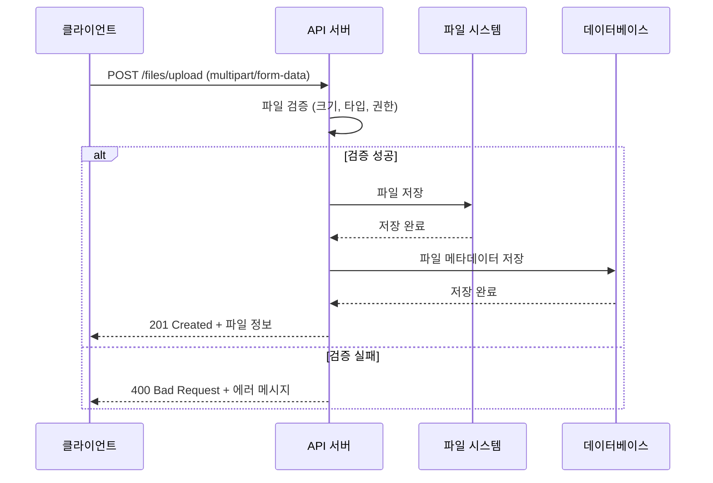
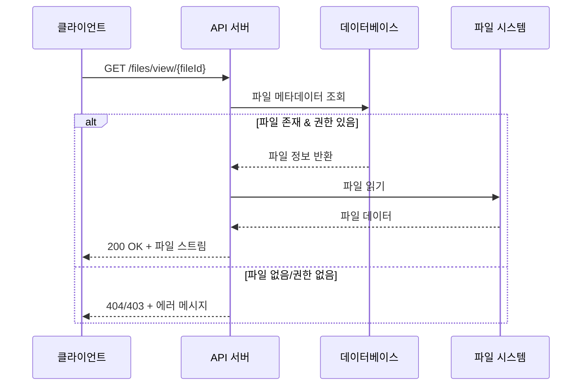

# 📁 파일 업로드/관리 시스템 명세

---

## 📋 파일 업로드 정책

### 1. 지원 파일 타입

#### 이미지 파일
| 확장자 | MIME Type | 최대 크기 | 용도 |
|--------|-----------|-----------|------|
| `.jpg`, `.jpeg` | `image/jpeg` | 5MB | 노트 이미지, 프로필 이미지 |
| `.png` | `image/png` | 5MB | 노트 이미지, 프로필 이미지 |
| `.gif` | `image/gif` | 3MB | 노트 애니메이션 이미지 |
| `.webp` | `image/webp` | 5MB | 최적화된 이미지 |

#### 문서 파일
| 확장자 | MIME Type | 최대 크기 | 용도 |
|--------|-----------|-----------|------|
| `.pdf` | `application/pdf` | 10MB | 참고 자료, 문제 파일 |
| `.doc`, `.docx` | `application/msword`, `application/vnd.openxmlformats-officedocument.wordprocessingml.document` | 10MB | 문서 첨부 |
| `.txt` | `text/plain` | 1MB | 텍스트 파일 |
| `.md` | `text/markdown` | 1MB | 마크다운 파일 |

### 2. 파일 크기 제한

| 파일 타입 | 개별 파일 최대 크기 | 사용자당 총 용량 | 노트당 최대 파일 수 |
|-----------|-------------------|------------------|---------------------|
| 이미지 | 5MB | 100MB | 10개 |
| 문서 | 10MB | 200MB | 5개 |
| 전체 | 10MB | 300MB | 15개 |

### 3. 파일명 규칙

#### 저장 파일명 생성
```java
// 예시: 2025/01/15/550e8400-e29b-41d4-a716-446655440000.jpg
String storedFileName = String.format("%s/%s.%s", 
    LocalDate.now().format(DateTimeFormatter.ofPattern("yyyy/MM/dd")),
    UUID.randomUUID().toString(),
    fileExtension
);
```

#### 파일 경로 구조
```
uploads/
├── users/
│   └── {user_id}/
│       ├── notes/
│       │   └── 2025/01/15/
│       │       ├── 550e8400-e29b-41d4-a716-446655440000.jpg
│       │       └── 660f9500-f39c-52e5-b827-557766551111.pdf
│       └── profile/
│           └── avatar.jpg
└── temp/                    # 임시 업로드 (1시간 후 자동 삭제)
    └── {session_id}/
```

---

## 🔧 파일 업로드 API 명세

### 1. `POST /files/upload`
**설명**: 파일 업로드 (노트 첨부용)
**인증**: 필요 (JWT)
**Content-Type**: `multipart/form-data`

#### Request
```javascript
const formData = new FormData();
formData.append('file', fileObject);
formData.append('noteId', 'uuid-of-note');  // 선택적
formData.append('purpose', 'note');         // 'note', 'profile'
```

#### Success Response (201 Created)
```json
{
  "guid": "G2025090412000011",
  "resultCode": "00000",
  "resultMessage": "파일 업로드 성공",
  "data": {
    "fileId": "123e4567-e89b-12d3-a456-426614174000",
    "originalName": "study_image.jpg",
    "storedName": "550e8400-e29b-41d4-a716-446655440000.jpg",
    "filePath": "/files/view/550e8400-e29b-41d4-a716-446655440000.jpg",
    "fileSize": 2048576,
    "mimeType": "image/jpeg",
    "uploadedAt": "2025-09-04T10:30:00Z"
  }
}
```

#### Error Responses
- `40003` 입력값이 유효하지 않습니다 (파일 없음, 잘못된 형식)
- `40004` 파일 크기가 제한을 초과했습니다
- `40005` 지원하지 않는 파일 형식입니다
- `42001` 사용자 저장 용량을 초과했습니다

### 2. `GET /files/view/{fileId}`
**설명**: 파일 조회/다운로드
**인증**: 필요 (본인 파일만 접근 가능)

#### Success Response
- **이미지 파일**: 브라우저에서 직접 표시
- **문서 파일**: `Content-Disposition: attachment` 헤더로 다운로드

#### Error Responses
- `43002` 존재하지 않는 파일입니다
- `41003` 파일 접근 권한이 없습니다

### 3. `DELETE /files/{fileId}`
**설명**: 파일 삭제
**인증**: 필요

#### Success Response (200 OK)
```json
{
  "guid": "G2025090412000033",
  "resultCode": "00000",
  "resultMessage": "파일이 삭제되었습니다",
  "data": {}
}
```

### 4. `GET /files/my-usage`
**설명**: 내 파일 사용량 조회
**인증**: 필요

#### Success Response
```json
{
  "guid": "G2025090412000044",
  "resultCode": "00000",
  "resultMessage": "사용량 조회 성공",
  "data": {
    "totalUsage": 52428800,        // 50MB (바이트)
    "totalLimit": 314572800,       // 300MB
    "usageByType": {
      "image": 31457280,           // 30MB
      "document": 20971520         // 20MB
    },
    "fileCount": 15,
    "fileLimit": 100
  }
}
```

---

## 🏗️ 파일 저장 아키텍처

### 1. 저장 방식 선택

#### 로컬 파일 시스템 (1차 구현)
```yaml
# application.yml
file:
  upload:
    base-path: ${user.home}/studytrack-uploads
    max-file-size: 10MB
    max-request-size: 50MB
    allowed-extensions: jpg,jpeg,png,gif,webp,pdf,doc,docx,txt,md
```

#### 클라우드 스토리지 (2차 확장)
- **AWS S3**: 확장성, 내구성 우수
- **Google Cloud Storage**: 비용 효율적
- **Azure Blob Storage**: 통합 서비스

### 2. 파일 처리 플로우

#### 업로드 시퀀스 다이어그램


#### 파일 조회 시퀀스 다이어그램


---

## 🛡️ 보안 및 검증

### 1. 파일 검증 로직

#### MIME Type 검증
```java
@Component
public class FileValidator {
    
    private static final Map<String, Set<String>> ALLOWED_MIME_TYPES = Map.of(
        "jpg", Set.of("image/jpeg"),
        "jpeg", Set.of("image/jpeg"),
        "png", Set.of("image/png"),
        "gif", Set.of("image/gif"),
        "webp", Set.of("image/webp"),
        "pdf", Set.of("application/pdf"),
        "txt", Set.of("text/plain"),
        "md", Set.of("text/markdown", "text/plain")
    );
    
    public boolean isValidFile(MultipartFile file) {
        String originalFilename = file.getOriginalFilename();
        String extension = getFileExtension(originalFilename).toLowerCase();
        String mimeType = file.getContentType();
        
        return ALLOWED_MIME_TYPES.getOrDefault(extension, Set.of())
                                 .contains(mimeType);
    }
}
```

#### 파일 내용 검증
```java
// 이미지 파일의 실제 헤더 검증
public boolean isValidImage(byte[] fileBytes) {
    // JPEG: FF D8 FF
    // PNG: 89 50 4E 47
    // GIF: 47 49 46 38
    return checkImageHeader(fileBytes);
}

// 악성 스크립트 검사 (PDF, 문서 파일)
public boolean containsMaliciousContent(MultipartFile file) {
    // 파일 내용에서 스크립트, 매크로 등 검사
    return false; // 구현 필요
}
```

### 2. 접근 권한 제어

#### 파일 접근 권한 검증
```java
@PreAuthorize("@fileSecurityService.canAccessFile(#fileId, authentication.name)")
@GetMapping("/files/view/{fileId}")
public ResponseEntity<Resource> viewFile(@PathVariable String fileId) {
    // 파일 조회 로직
}
```

#### 사용자별 용량 제한
```java
@Component
public class StorageQuotaService {
    
    public void checkQuota(String userId, long fileSize) {
        long currentUsage = getCurrentUsage(userId);
        long maxQuota = getMaxQuota(userId);
        
        if (currentUsage + fileSize > maxQuota) {
            throw new QuotaExceededException("저장 용량을 초과했습니다");
        }
    }
}
```

---

## 🔄 파일 생명주기 관리

### 1. 임시 파일 정리

#### 스케줄링된 정리 작업
```java
@Scheduled(cron = "0 0 2 * * ?") // 매일 새벽 2시
public void cleanupTempFiles() {
    // 1시간 이상 된 임시 파일 삭제
    Path tempDir = Paths.get(uploadBasePath, "temp");
    Files.walk(tempDir)
         .filter(path -> isOlderThan(path, Duration.ofHours(1)))
         .forEach(this::deleteFile);
}

@Scheduled(cron = "0 0 3 * * ?") // 매일 새벽 3시
public void cleanupDeletedFiles() {
    // is_deleted = true이고 30일 이상 된 파일 물리 삭제
    List<FileAttachment> deletedFiles = fileRepository
        .findDeletedFilesOlderThan(LocalDateTime.now().minusDays(30));
    
    deletedFiles.forEach(this::physicallyDeleteFile);
}
```

### 2. 파일 백업 전략

#### 정기 백업 (운영 환경)
```bash
#!/bin/bash
# 매일 사용자 파일 백업
DATE=$(date +%Y%m%d)
tar -czf "backup_files_$DATE.tar.gz" /app/uploads/users/
aws s3 cp "backup_files_$DATE.tar.gz" s3://studytrack-backup/files/
```

---

## 📊 모니터링 및 로깅

### 1. 파일 업로드 로깅
```java
@EventListener
public void handleFileUpload(FileUploadEvent event) {
    log.info("File uploaded - User: {}, File: {}, Size: {}, Type: {}", 
        event.getUserId(), 
        event.getFileName(), 
        event.getFileSize(), 
        event.getMimeType());
}
```

### 2. 용량 모니터링
```java
@Component
public class StorageMonitoringService {
    
    @Scheduled(fixedRate = 300000) // 5분마다
    public void monitorDiskUsage() {
        long totalSpace = Paths.get(uploadBasePath).toFile().getTotalSpace();
        long freeSpace = Paths.get(uploadBasePath).toFile().getFreeSpace();
        long usedSpace = totalSpace - freeSpace;
        
        double usagePercent = (double) usedSpace / totalSpace * 100;
        
        if (usagePercent > 80) {
            log.warn("Disk usage high: {}%", usagePercent);
            // 알림 발송 로직
        }
    }
}
```

---

## 🚀 성능 최적화

### 1. 이미지 최적화

#### 자동 리사이징
```java
@Service
public class ImageProcessingService {
    
    public byte[] optimizeImage(byte[] originalImage, String mimeType) {
        // 이미지 크기가 1920x1080보다 크면 리사이징
        // 품질 85%로 압축
        return processedImage;
    }
}
```

#### 썸네일 생성
```java
public void generateThumbnail(String fileId, byte[] imageData) {
    byte[] thumbnail = createThumbnail(imageData, 300, 300);
    saveThumbnail(fileId, thumbnail);
}
```

### 2. CDN 연동 (추후 고려)
```java
// CloudFront, CloudFlare 등 CDN을 통한 파일 제공
public String getCdnUrl(String fileId) {
    return String.format("https://cdn.studytrack.com/files/%s", fileId);
}
```

이제 모든 보완 필요 사항들이 상세하게 정리되었습니다!
