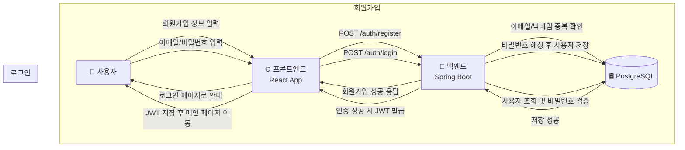
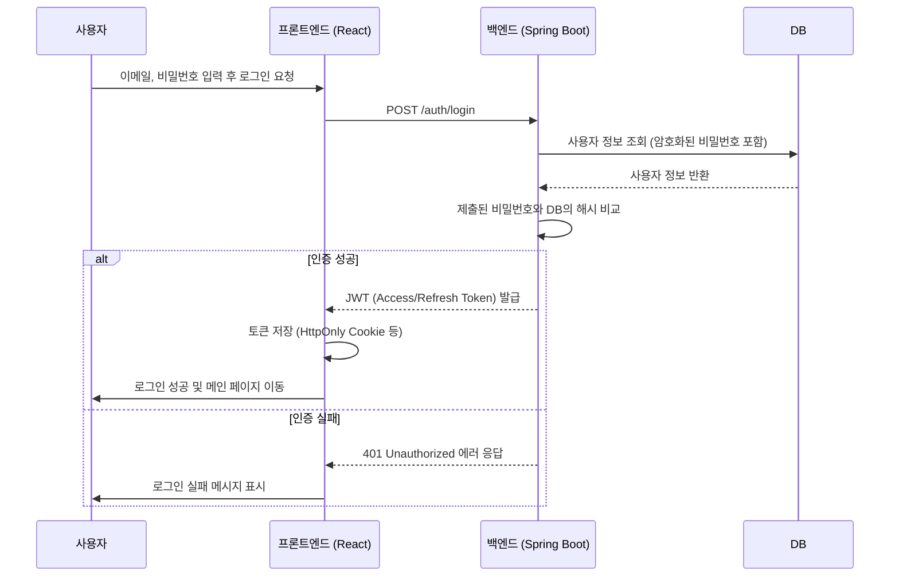
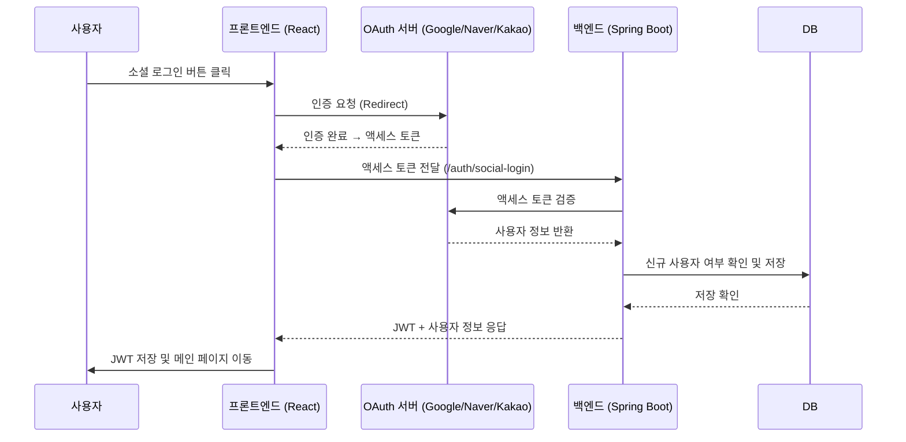

## F-01 로그인 및 인증

### 1. 개요
- **자체 로그인**과 **소셜 로그인(Google, Naver, Kakao)**을 모두 지원합니다.
- 모든 인증 방식은 최종적으로 서버에서 **JWT(JSON Web Token)**를 발급받아 사용합니다.
- 인증 관련 모든 API 통신은 **HTTPS**를 통해 암호화되어야 합니다.

### 2. 주요 기능 및 개발 항목
#### 자체 인증 (Email/Password)
- [T-01-F] 자체 회원가입/로그인 페이지 UI 구성 ⭐ High
- [T-02-F] 이메일/비밀번호 유효성 검사 로직 구현 ⭐ High
- [T-03-B] 자체 회원가입 API (`/auth/register`) 구현 ⭐ High
- [T-04-B] 자체 로그인 API (`/auth/login`) 구현 ⭐ High
- [T-05-B] 비밀번호 암호화(BCrypt) 및 중복 확인 로직 ⭐ High
- [T-06-F] 회원가입/로그인 API 연동 및 에러 핸들링 ⭐ Medium

#### 소셜 로그인 (OAuth2)
- [T-07-F] 소셜 로그인 버튼 UI (Google, Naver, Kakao) 구성 ⭐ High
- [T-08-B] OAuth 인증 처리 API (`/auth/social-login`) 구성 ⭐ High
- [T-09-B] 액세스 토큰 유효성 검증 및 JWT 발급 공통 로직 ⭐ High
- [T-10-F] 로그인 성공/실패 UX 처리 공통화 ⭐ Medium

#### 공통
- [T-11-B] JWT 저장 정책 수립 및 Refresh Token 로직 구현 ⭐ Medium
- [T-12-F] 로그인 상태 유지 및 로그아웃 처리 ⭐ Medium

### 3. 데이터 흐름 (DFD)

#### 3.1. 자체 회원가입 및 로그인


#### 3.2. 소셜 로그인
```mermaid
flowchart TD
    User[🧑 사용자]
    FE[🌐 프론트엔드<br/>React App]
    OAuth[🔑 OAuth 서버<br/>(Google/Naver/Kakao)]
    BE[🚀 백엔드<br/>Spring Boot]
    DB[(🛢️ PostgreSQL)]

    User -->|소셜 로그인 버튼 클릭| FE
    FE -->|OAuth 인증 요청| OAuth
    OAuth -->|액세스 토큰 전달| FE
    FE -->|POST /auth/social-login<br/>+ 액세스 토큰| BE
    BE -->|토큰 검증 및 사용자 조회| OAuth
    BE -->|신규 사용자면 저장| DB
    DB -->|저장 확인| BE
    BE -->|JWT 발급 + 사용자 정보 반환| FE
    FE -->|JWT 저장 후 메인 페이지 이동| User
```

### 4. 시퀀스 다이어그램

#### 4.1. 자체 로그인


#### 4.2. 소셜 로그인


### 5. 핵심 보안 요구사항

| 항목 | 내용 | 필수 구현 사항 |
| :--- | :--- | :--- |
| **비밀번호 저장** | 사용자의 비밀번호는 절대 평문으로 저장해서는 안 되며, 복호화가 불가능한 단방향 해시 함수를 사용해야 합니다. | - **BCrypt** 또는 **Argon2** 사용<br>- 사용자별로 고유한 Salt를 적용하여 Rainbow Table 공격 방지 |
| **인증 토큰** | 상태 비저장(Stateless) 인증을 위해 JWT를 사용하며, 토큰 탈취에 대비한 정책이 필요합니다. | - Access Token은 만료 시간을 짧게(예: 15분~1시간) 설정<br>- Refresh Token은 만료 시간을 길게(예: 7일~30일) 설정하고, 안전한 저장소(DB 등)에 보관<br>- Refresh Token을 사용하여 Access Token을 재발급하는 로직 구현 |
| **전송 계층 보안** | 클라이언트와 서버 간의 모든 통신은 암호화되어야 합니다. | - **HTTPS/TLS** 적용 필수 |
| **로그인 시도 제한** | Brute-force 및 무차별 대입 공격을 방지하기 위한 보호 조치가 필요합니다. | - 특정 시간 동안 일정 횟수 이상 로그인 실패 시 계정 잠금(예: 5회 실패 시 5분간 잠금)<br>- IP 기반으로도 요청 횟수를 제한하여 비정상적인 트래픽 차단 |
| **보안 헤더** | XSS, CSRF 등 웹 취약점 공격을 방지하기 위해 HTTP 응답 헤더를 설정해야 합니다. | - `X-Content-Type-Options: nosniff`<br>- `X-Frame-Options: deny`<br>- `Content-Security-Policy` (CSP) 설정 |
| **세션/토큰 관리** | 로그아웃 및 토큰 만료 시 명확한 처리가 필요합니다. | - 로그아웃 시 서버에서 Refresh Token을 무효화 처리<br>- 클라이언트 측에서도 저장된 토큰을 즉시 삭제 |

### 6. API 상세 명세

(API 명세 내용은 기존과 동일)

---
---

## F-02 학습 분야 생성 및 관리

### 1. 개요
- 사용자가 자유롭게 학습 분야(주제)를 생성하고 관리합니다.
- 각 분야는 노트 및 문제와 연결됩니다.

### 2. 주요 기능 및 개발 항목
- [T-13-F] 학습 분야 리스트 및 CRUD UI ⭐ High
- [T-14-B] 분야 API (생성/수정/삭제/조회) ⭐ High
- [T-15-F] 분야 실시간 검색 필터 기능 구현 ⭐ Medium
- [T-16-F] 선택된 분야에 따른 연관 노트 및 문제 표시 ⭐ Medium

### 3. API 상세 명세

#### 1. `POST /api/v1/subjects`
- **설명**: 새로운 학습 분야를 생성합니다.
- **인증**: 필요 (Bearer Token)

**Request Body**
| 필드 | 타입 | 제약조건 | 설명 |
|---|---|---|---|
| `name` | String | `Not Null`, `Max 100` | 생성할 분야의 이름 |

**Success Response (`201 Created`)**
| 필드 | 타입 | 설명 |
|---|---|---|
| `id` | UUID | 생성된 분야의 고유 ID |
| `name` | String | 생성된 분야의 이름 |

**Error Responses**
| Status Code | errorCode | 설명 |
|---|---|---|
| `400 Bad Request` | `NAME_REQUIRED` | `name` 필드가 누락된 경우 |
| `401 Unauthorized` | `UNAUTHORIZED` | 인증되지 않은 사용자의 요청 |
| `409 Conflict` | `SUBJECT_NAME_DUPLICATED` | 이미 동일한 이름의 분야가 존재하는 경우 |

#### 2. `GET /api/v1/subjects`
- **설명**: 현재 사용자가 생성한 모든 학습 분야 목록을 조회합니다.
- **인증**: 필요 (Bearer Token)

**Success Response (`200 OK`)**
- **Response Body**: `Array<Object>`
| 필드 | 타입 | 설명 |
|---|---|---|
| `id` | UUID | 분야 고유 ID |
| `name` | String | 분야 이름 |

#### 3. `PUT /api/v1/subjects/{subjectId}`
- **설명**: 특정 학습 분야의 이름을 수정합니다.
- **인증**: 필요 (Bearer Token)

**Path Parameter**
| 필드 | 타입 | 설명 |
|---|---|---|
| `subjectId` | UUID | 수정할 분야의 ID |

**Request Body**
| 필드 | 타입 | 제약조건 | 설명 |
|---|---|---|---|
| `name` | String | `Not Null`, `Max 100` | 변경할 분야의 새 이름 |

**Success Response (`200 OK`)**
| 필드 | 타입 | 설명 |
|---|---|---|
| `id` | UUID | 수정된 분야의 고유 ID |
| `name` | String | 수정된 분야의 이름 |

#### 4. `DELETE /api/v1/subjects/{subjectId}`
- **설명**: 특정 학습 분야를 삭제합니다.
- **인증**: 필요 (Bearer Token)

**Path Parameter**
| 필드 | 타입 | 설명 |
|---|---|---|
| `subjectId` | UUID | 삭제할 분야의 ID |

**Success Response (`204 No Content`)**
- Body 없음.

---
---

## F-03 노트 관리 (TipTap Editor)

### 1. 개요
- 사용자가 선택한 학습 분야 안에 자유롭게 노트를 작성하고 관리합니다.
- 에디터는 TipTap 라이브러리를 사용합니다.

### 2. 주요 기능 및 개발 항목
- [T-17-F] TipTap 에디터 컴포넌트 구현 ⭐ High
- [T-18-B] 노트 CRUD API 구현 ⭐ High
- [T-19-F] 저장 버튼 및 수동 저장 처리 UX ⭐ High
- [T-20-F] 마크다운 → HTML 미리보기 기능 ⭐ Low
- [T-21-F] 노트 리스트 화면 및 최근순 정렬 ⭐ Medium
- [T-22-F] 실시간 저장 기능 (추후) ⭐ Low

### 3. API 상세 명세

#### 1. `POST /api/v1/notes`
- **설명**: 새로운 노트를 생성합니다.
- **인증**: 필요 (Bearer Token)

**Request Body**
| 필드 | 타입 | 제약조건 | 설명 |
|---|---|---|---|
| `subjectId` | UUID | `Not Null` | 노트가 소속될 학습 분야 ID |
| `categoryId`| UUID | | 노트가 소속될 카테고리 ID (선택) |
| `title` | String | `Not Null`, `Max 255` | 노트 제목 |
| `content` | String | | 노트 내용 (HTML 또는 Markdown) |

**Success Response (`201 Created`)**
| 필드 | 타입 | 설명 |
|---|---|---|
| `id` | UUID | 생성된 노트의 고유 ID |

(이하 생략...)
---
---

## F-04 문제 생성/풀이

### 1. 개요
- 사용자는 학습한 내용을 바탕으로 직접 문제를 만들고 풀어볼 수 있습니다.
- 문제 유형은 **객관식, 주관식, 단답형**을 지원합니다.
- 주관식 문제의 채점은 **LLM(Large Language Model)을 활용**하여 자동화합니다.

### 2. 주요 기능 및 개발 항목
- [T-23-F] 문제 생성 UI (객관식/주관식/단답형) ⭐ High
- [T-24-B] 문제 저장/조회 API 구현 ⭐ High
- [T-25-F] 문제 풀이 팝업 + 타이머 기능 ⭐ High
- [T-26-B] LLM 채점 API 구성 및 통신 처리 ⭐ Medium
- [T-27-B] 문제풀이 결과 저장 처리 ⭐ High
- [T-28-B] 오답 자동 저장 처리 (WrongNote 연결) ⭐ High

### 3. API 상세 명세

#### 1. `POST /api/v1/questions`
- **설명**: 새로운 문제를 생성합니다.
- **인증**: 필요 (Bearer Token)

**Request Body**
| 필드 | 타입 | 제약조건 | 설명 |
|---|---|---|---|
| `subjectId` | UUID | `Not Null` | 문제가 소속될 학습 분야 ID |
| `questionType` | Enum | `Not Null` | 문제 유형 (`MULTIPLE_CHOICE`, `SHORT_ANSWER`, `DESCRIPTIVE`) |
| `questionText`| String | `Not Null` | 문제 내용 |
| `options` | Array<Object> | | 객관식 보기 (객관식인 경우 필수) |
| `answer` | String | `Not Null` | 정답 |

**Success Response (`201 Created`)**
| 필드 | 타입 | 설명 |
|---|---|---|
| `id` | UUID | 생성된 문제의 고유 ID |

#### 2. `POST /api/v1/questions/{questionId}/submit`
- **설명**: 사용자가 제출한 답안을 채점하고 결과를 저장합니다.
- **인증**: 필요 (Bearer Token)

**Path Parameter**
| 필드 | 타입 | 설명 |
|---|---|---|
| `questionId` | UUID | 채점할 문제의 ID |

**Request Body**
| 필드 | 타입 | 제약조건 | 설명 |
|---|---|---|---|
| `submittedAnswer` | String | `Not Null` | 사용자가 제출한 답안 |

**Success Response (`200 OK`)**
| 필드 | 타입 | 설명 |
|---|---|---|
| `isCorrect` | Boolean | 채점 결과 (정답/오답) |
| `feedback` | String | (주관식) LLM이 생성한 피드백 |
| `correctAnswer`| String | 실제 정답 |


## F-04 문제 생성/풀이

### 1. 개요
- 사용자는 학습한 내용을 바탕으로 직접 문제를 만들고 풀어볼 수 있습니다.
- 문제 유형은 **객관식, 주관식, 단답형**을 지원합니다.
- 주관식 문제의 채점은 **LLM(Large Language Model)을 활용**하여 자동화합니다.

### 2. 주요 기능 및 개발 항목
- [T-23-F] 문제 생성 UI (객관식/주관식/단답형) ⭐ High
- [T-24-B] 문제 저장/조회 API 구현 ⭐ High
- [T-25-F] 문제 풀이 팝업 + 타이머 기능 ⭐ High
- [T-26-B] LLM 채점 API 구성 및 통신 처리 ⭐ Medium
- [T-27-B] 문제풀이 결과 저장 처리 ⭐ High
- [T-28-B] 오답 자동 저장 처리 (WrongNote 연결) ⭐ High

(이하 생략...)

---
---

## F-05 오답노트 관리

### 1. 개요
- 문제 풀이 세션에서 틀린 문제나 사용자가 직접 북마크한 문제가 자동으로 오답노트에 기록됩니다.
- 사용자는 오답노트에서 문제를 다시 풀어보거나, 해설을 확인하며 복습할 수 있습니다.

### 2. 주요 기능 및 개발 항목
- [T-29-B] 오답노트 API 구조 및 저장 처리 ⭐ High
- [T-30-F] 틀린/북마크 문제 필터 UI 구현 ⭐ Medium
- [T-31-F] 오답노트 문제 다시 풀기 UI ⭐ Medium
- [T-32-F] LLM 채점 결과 히스토리/시각화 ⭐ Medium

### 3. API 상세 명세

#### 1. `GET /api/v1/wrong-notes`
- **설명**: 오답노트에 기록된 문제 목록을 조회합니다.
- **인증**: 필요 (Bearer Token)
- **Query Parameters**:
    - `subjectId` (UUID, optional): 특정 학습 분야의 오답만 필터링합니다.
    - `isBookmarked` (Boolean, optional): 북마크된 문제만 필터링합니다.

**Success Response (`200 OK`)**
- **Response Body**: `Array<Object>`
| 필드 | 타입 | 설명 |
|---|---|---|
| `wrongNoteId` | UUID | 오답노트 항목 ID |
| `question` | Object | 문제 정보 (F-04의 문제 형식과 동일) |
| `submittedAt` | DateTime | 마지막으로 문제를 푼 시각 |
| `isCorrect` | Boolean | 마지막 풀이 결과 |

#### 2. `POST /api/v1/questions/{questionId}/bookmark`
- **설명**: 특정 문제를 오답노트에 북마크로 추가하거나 해제합니다.
- **인증**: 필요 (Bearer Token)

**Path Parameter**
| 필드 | 타입 | 설명 |
|---|---|---|
| `questionId` | UUID | 북마크할 문제의 ID |

**Success Response (`200 OK`)**
| 필드 | 타입 | 설명 |
|---|---|---|
| `isBookmarked` | Boolean | 북마크 설정 상태 |

---
---

## F-06 암기 세션 모드

### 1. 개요
- 사용자가 작성한 노트를 기반으로 암기 카드를 생성하여 효율적인 학습을 돕습니다.
- 플래시카드 형식을 기본으로 하며, 사용자가 직접 암기 여부를 체크하고 결과를 저장합니다.

### 2. 주요 기능 및 개발 항목
- [T-33-F] 암기 카드 UI (플립/문제형 전환) ⭐ Medium
- [T-34-B] 암기 결과 저장 처리 ⭐ Medium
- [T-35-F] 암기 결과 요약/히트맵 화면 ⭐ Medium
- [T-36-F] 세션 무작위/반복 설정 UI ⭐ Low

### 3. API 상세 명세

#### 1. `POST /api/v1/sessions/memorization`
- **설명**: 특정 학습 분야나 노트들을 기반으로 새로운 암기 세션을 시작합니다.
- **인증**: 필요 (Bearer Token)

**Request Body**
| 필드 | 타입 | 제약조건 | 설명 |
|---|---|---|---|
| `subjectId` | UUID | `Optional` | 세션을 구성할 학습 분야 ID |
| `noteIds` | Array<UUID> | `Optional` | 세션에 포함할 특정 노트 ID 목록 |

**Success Response (`201 Created`)**
| 필드 | 타입 | 설명 |
|---|---|---|
| `sessionId` | UUID | 생성된 암기 세션의 고유 ID |
| `cards` | Array<Object> | 세션에 포함된 암기 카드 목록 |

#### 2. `POST /api/v1/sessions/memorization/{sessionId}/record`
- **설명**: 개별 암기 카드에 대한 학습 결과를 기록합니다.
- **인증**: 필요 (Bearer Token)

**Request Body**
| 필드 | 타입 | 제약조건 | 설명 |
|---|---|---|---|
| `cardId` | UUID | `Not Null` | 학습 결과를 기록할 카드 ID |
| `status` | Enum | `Not Null` | 암기 상태 (`MEMORIZED`, `FORGOTTEN`) |

**Success Response (`204 No Content`)**
- Body 없음.

---
---

## F-07 학습 캘린더

### 1. 개요
- 사용자가 일별로 학습 목표를 설정하고 달성 여부를 추적할 수 있는 캘린더 기능입니다.
- 학습 기록과 연동하여 시각적인 피드백을 제공합니다.

### 2. 주요 기능 및 개발 항목
- [T-37-F] 날짜별 목표 입력 UI ⭐ High
- [T-38-B] 목표 상태 저장 및 미체크 → 미완료 처리 ⭐ Medium
- [T-39-F] 과거 목표 수정 가능 처리 ⭐ Medium
- [T-40-F] 반복 일정 기능 (추후 고려) ⭐ Low

### 3. API 상세 명세

#### 1. `POST /api/v1/calendar/goals`
- **설명**: 특정 날짜에 새로운 학습 목표를 추가합니다.
- **인증**: 필요 (Bearer Token)

**Request Body**
| 필드 | 타입 | 제약조건 | 설명 |
|---|---|---|---|
| `goalDate` | Date | `Not Null` | 목표 날짜 (YYYY-MM-DD) |
| `content` | String | `Not Null` | 목표 내용 |

**Success Response (`201 Created`)**
| 필드 | 타입 | 설명 |
|---|---|---|
| `goalId` | UUID | 생성된 목표의 고유 ID |

#### 2. `GET /api/v1/calendar/goals`
- **설명**: 특정 기간 동안의 학습 목표 목록을 조회합니다.
- **인증**: 필요 (Bearer Token)
- **Query Parameters**:
    - `startDate` (Date): 조회 시작일
    - `endDate` (Date): 조회 종료일

**Success Response (`200 OK`)**
- **Response Body**: `Array<Object>`
| 필드 | 타입 | 설명 |
|---|---|---|
| `goalId` | UUID | 목표 ID |
| `goalDate` | Date | 목표 날짜 |
| `content` | String | 목표 내용 |
| `isCompleted`| Boolean | 달성 여부 |

#### 3. `PUT /api/v1/calendar/goals/{goalId}`
- **설명**: 기존 학습 목표의 내용을 수정하거나 상태를 변경합니다.
- **인증**: 필요 (Bearer Token)

**Request Body**
| 필드 | 타입 | 제약조건 | 설명 |
|---|---|---|---|
| `content` | String | `Optional` | 수정할 목표 내용 |
| `isCompleted`| Boolean | `Optional` | 달성 여부 |

**Success Response (`200 OK`)**
- 수정된 목표 객체 반환