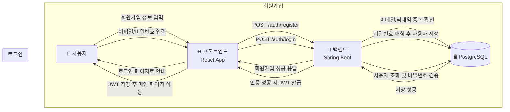
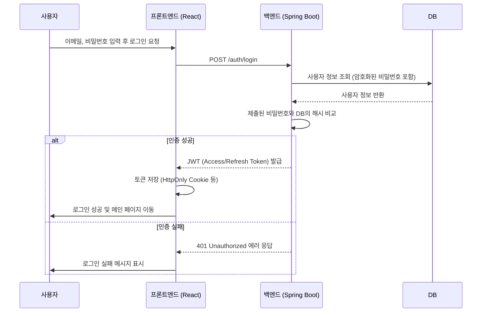
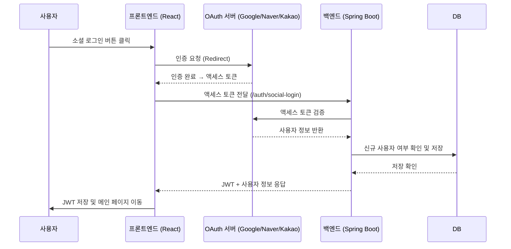

## F-01 로그인 및 인증

### 1. 개요
- **자체 로그인**과 **소셜 로그인(Google, Naver, Kakao)**을 모두 지원합니다.
- 모든 인증 방식은 최종적으로 서버에서 **JWT(JSON Web Token)**를 발급받아 사용합니다.
- 인증 관련 모든 API 통신은 **HTTPS**를 통해 암호화되어야 합니다.

### 2. 데이터 흐름 (DFD)

#### 2.1. 자체 회원가입 및 로그인


#### 2.2. 소셜 로그인
```mermaid
flowchart TD
    User[🧑 사용자]
    FE[🌐 프론트엔드<br/>React App]
    OAuth[🔑 OAuth 서버<br/>(Google/Naver/Kakao)]
    BE[🚀 백엔드<br/>Spring Boot]
    DB[(🛢️ PostgreSQL)]

    User -->|소셜 로그인 버튼 클릭| FE
    FE -->|OAuth 인증 요청| OAuth
    OAuth -->|액세스 토큰 전달| FE
    FE -->|POST /auth/social-login<br/>+ 액세스 토큰| BE
    BE -->|토큰 검증 및 사용자 조회| OAuth
    BE -->|신규 사용자면 저장| DB
    DB -->|저장 확인| BE
    BE -->|JWT 발급 + 사용자 정보 반환| FE
    FE -->|JWT 저장 후 메인 페이지 이동| User
```

### 3. 시퀀스 다이어그램

#### 3.1. 자체 로그인


#### 3.2. 소셜 로그인


### 4. 핵심 보안 요구사항

| 항목 | 내용 | 필수 구현 사항 |
| :--- | :--- | :--- |
| **비밀번호 저장** | 사용자의 비밀번호는 절대 평문으로 저장해서는 안 되며, 복호화가 불가능한 단방향 해시 함수를 사용해야 합니다. | - **BCrypt** 또는 **Argon2** 사용<br>- 사용자별로 고유한 Salt를 적용하여 Rainbow Table 공격 방지 |
| **인증 토큰** | 상태 비저장(Stateless) 인증을 위해 JWT를 사용하며, 토큰 탈취에 대비한 정책이 필요합니다. | - Access Token은 만료 시간을 짧게(예: 15분~1시간) 설정<br>- Refresh Token은 만료 시간을 길게(예: 7일~30일) 설정하고, 안전한 저장소(DB 등)에 보관<br>- Refresh Token을 사용하여 Access Token을 재발급하는 로직 구현 |
| **전송 계층 보안** | 클라이언트와 서버 간의 모든 통신은 암호화되어야 합니다. | - **HTTPS/TLS** 적용 필수 |
| **로그인 시도 제한** | Brute-force 및 무차별 대입 공격을 방지하기 위한 보호 조치가 필요합니다. | - 특정 시간 동안 일정 횟수 이상 로그인 실패 시 계정 잠금(예: 5회 실패 시 5분간 잠금)<br>- IP 기반으로도 요청 횟수를 제한하여 비정상적인 트래픽 차단 |
| **보안 헤더** | XSS, CSRF 등 웹 취약점 공격을 방지하기 위해 HTTP 응답 헤더를 설정해야 합니다. | - `X-Content-Type-Options: nosniff`<br>- `X-Frame-Options: deny`<br>- `Content-Security-Policy` (CSP) 설정 |
| **세션/토큰 관리** | 로그아웃 및 토큰 만료 시 명확한 처리가 필요합니다. | - 로그아웃 시 서버에서 Refresh Token을 무효화 처리<br>- 클라이언트 측에서도 저장된 토큰을 즉시 삭제 |

### 5. API 상세 명세

(API 명세 내용은 기존과 동일)