## F-01 로그인 및 인증

### 1. 개요
- **자체 로그인**과 **소셜 로그인(Google, Naver, Kakao)**을 모두 지원합니다.
- 모든 인증 방식은 최종적으로 서버에서 **JWT(JSON Web Token)**를 발급받아 사용합니다.
- 인증 관련 모든 API 통신은 **HTTPS**를 통해 암호화되어야 합니다.

### 2. 주요 기능 및 개발 항목
#### 자체 인증 (Email/Password)
- [T-01-F] 자체 회원가입/로그인 페이지 UI 구성 ⭐ High
- [T-02-F] 이메일/비밀번호 유효성 검사 로직 구현 ⭐ High
- [T-03-B] 자체 회원가입 API (`/auth/register`) 구현 ⭐ High
- [T-04-B] 자체 로그인 API (`/auth/login`) 구현 ⭐ High
- [T-05-B] 비밀번호 암호화(BCrypt) 및 중복 확인 로직 ⭐ High
- [T-06-F] 회원가입/로그인 API 연동 및 에러 핸들링 ⭐ Medium

#### 소셜 로그인 (OAuth2)
- [T-07-F] 소셜 로그인 버튼 UI (Google, Naver, Kakao) 구성 ⭐ High
- [T-08-B] OAuth 인증 처리 API (`/auth/social-login`) 구성 ⭐ High
- [T-09-B] 액세스 토큰 유효성 검증 및 JWT 발급 공통 로직 ⭐ High
- [T-10-F] 로그인 성공/실패 UX 처리 공통화 ⭐ Medium

#### 공통
- [T-11-B] JWT 저장 정책 수립 및 Refresh Token 로직 구현 ⭐ Medium
- [T-12-F] 로그인 상태 유지 및 로그아웃 처리 ⭐ Medium

### 3. 데이터 흐름 (DFD)

#### 3.1. 자체 회원가입 및 로그인
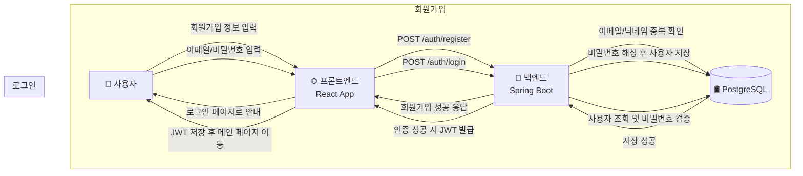

#### 3.2. 소셜 로그인
```mermaid
flowchart TD
    User[🧑 사용자]
    FE[🌐 프론트엔드<br/>React App]
    OAuth[🔑 OAuth 서버<br/>(Google/Naver/Kakao)]
    BE[🚀 백엔드<br/>Spring Boot]
    DB[(🛢️ PostgreSQL)]

    User -->|소셜 로그인 버튼 클릭| FE
    FE -->|OAuth 인증 요청| OAuth
    OAuth -->|액세스 토큰 전달| FE
    FE -->|POST /auth/social-login<br/>+ 액세스 토큰| BE
    BE -->|토큰 검증 및 사용자 조회| OAuth
    BE -->|신규 사용자면 저장| DB
    DB -->|저장 확인| BE
    BE -->|JWT 발급 + 사용자 정보 반환| FE
    FE -->|JWT 저장 후 메인 페이지 이동| User
```

### 4. 시퀀스 다이어그램

#### 4.1. 자체 로그인
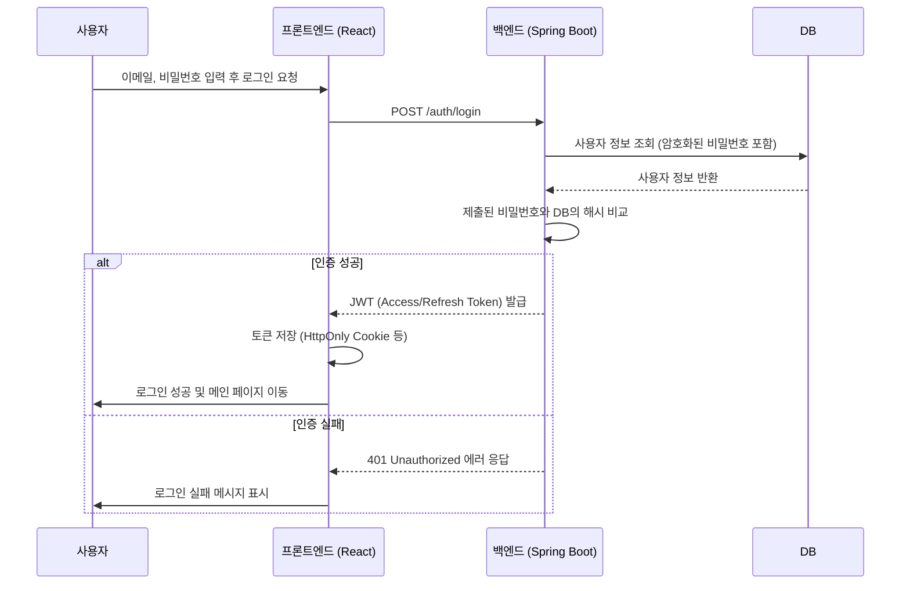

#### 4.2. 소셜 로그인
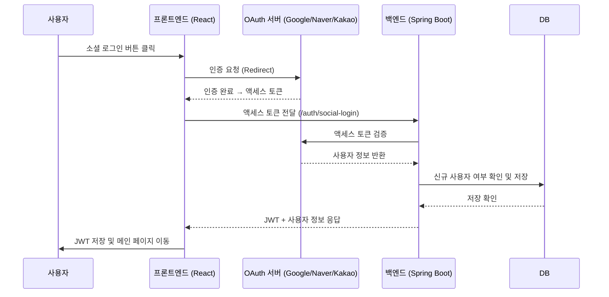

### 5. 핵심 보안 요구사항

| 항목 | 내용 | 필수 구현 사항 |
| :--- | :--- | :--- |
| **비밀번호 저장** | 사용자의 비밀번호는 절대 평문으로 저장해서는 안 되며, 복호화가 불가능한 단방향 해시 함수를 사용해야 합니다. | - **BCrypt** 또는 **Argon2** 사용<br>- 사용자별로 고유한 Salt 적용 |
| **인증 토큰** | 상태 비저장(Stateless) 인증을 위해 JWT를 사용하며, 토큰 탈취에 대비한 정책이 필요합니다. | - Access Token 만료 시간: 15분~1시간<br>- Refresh Token 만료 시간: 7~30일, DB 저장<br>- Refresh Token 기반 재발급 로직 구현 |
| **전송 계층 보안** | 모든 클라이언트-서버 통신은 암호화 | - **HTTPS/TLS** 적용 |
| **로그인 시도 제한** | 무차별 대입 공격 방지 | - 5회 실패 시 5분간 계정 잠금<br>- IP 기반 Rate Limit 적용 |
| **보안 헤더** | XSS, CSRF 등 방지 | - `X-Content-Type-Options: nosniff`<br>- `X-Frame-Options: deny`<br>- `Content-Security-Policy` (CSP) |
| **세션/토큰 관리** | 로그아웃 및 만료 시 명확한 처리 | - 로그아웃 시 Refresh Token 무효화<br>- 클라이언트 저장 토큰 삭제 |

### 6. API 상세 명세

#### 1. `POST /auth/register`
- **설명**: 자체 회원가입 수행
- **인증**: 불필요 (비로그인 상태)

**Request Body**
| 필드 | 타입 | 제약조건 | 설명 |
|---|---|---|---|
| `email` | String | `Not Null`, 이메일 형식 | 사용자 이메일 |
| `password` | String | `Not Null`, 최소 8자 | 비밀번호 |
| `nickname` | String | `Not Null`, 최대 50자 | 닉네임 |

**Success Response (201 Created)**
| 필드 | 타입 | 설명 |
|---|---|---|
| `id` | UUID | 생성된 사용자 ID |
| `email` | String | 사용자 이메일 |

**Error Responses**
| Status | errorCode | 설명 |
|---|---|---|
| 400 | `INVALID_INPUT` | 잘못된 입력 |
| 409 | `EMAIL_DUPLICATED` | 이메일 중복 |
| 409 | `NICKNAME_DUPLICATED` | 닉네임 중복 |

---

#### 2. `POST /auth/login`
- **설명**: 자체 로그인 수행
- **인증**: 불필요 (비로그인 상태)

**Request Body**
| 필드 | 타입 | 제약조건 | 설명 |
|---|---|---|---|
| `email` | String | `Not Null` | 사용자 이메일 |
| `password` | String | `Not Null` | 사용자 비밀번호 |

**Success Response (200 OK)**
| 필드 | 타입 | 설명 |
|---|---|---|
| `accessToken` | String | Access Token |
| `refreshToken` | String | Refresh Token |

**Error Responses**
| Status | errorCode | 설명 |
|---|---|---|
| 401 | `INVALID_CREDENTIALS` | 이메일/비밀번호 불일치 |
| 403 | `ACCOUNT_DISABLED` | 계정 비활성화 |

---

#### 3. `POST /auth/social-login`
- **설명**: 소셜 로그인 수행 (Google, Naver, Kakao)
- **인증**: 불필요 (OAuth 토큰 기반)

**Request Body**
| 필드 | 타입 | 설명 |
|---|---|---|
| `provider` | String | 소셜 로그인 제공자 (`google`, `naver`, `kakao`) |
| `accessToken` | String | 소셜 서버에서 발급된 액세스 토큰 |

**Success Response (200 OK)**
| 필드 | 타입 | 설명 |
|---|---|---|
| `accessToken` | String | Access Token |
| `refreshToken` | String | Refresh Token |

**Error Responses**
| Status | errorCode | 설명 |
|---|---|---|
| 401 | `INVALID_SOCIAL_TOKEN` | 액세스 토큰 검증 실패 |

---

#### 4. `POST /auth/logout`
- **설명**: 로그아웃 수행
- **인증**: 필요 (Bearer Token)

**Request Body** 없음

**Success Response (204 No Content)**
- Refresh Token 무효화 및 클라이언트 측 삭제

---

## F-02 학습 분야 관리

### 1. 개요
- 사용자가 자유롭게 학습 분야(주제)를 생성하고 관리합니다.
- 각 분야는 노트 및 문제와 연결됩니다.

### 2. 주요 기능 및 개발 항목
- [T-13-F] 학습 분야 리스트 및 CRUD UI ⭐ High
- [T-14-B] 분야 API (생성/수정/삭제/조회) ⭐ High
- [T-15-F] 분야 실시간 검색 필터 기능 구현 ⭐ Medium
- [T-16-F] 선택된 분야에 따른 연관 노트 및 문제 표시 ⭐ Medium

### 3. 데이터 흐름 (DFD)
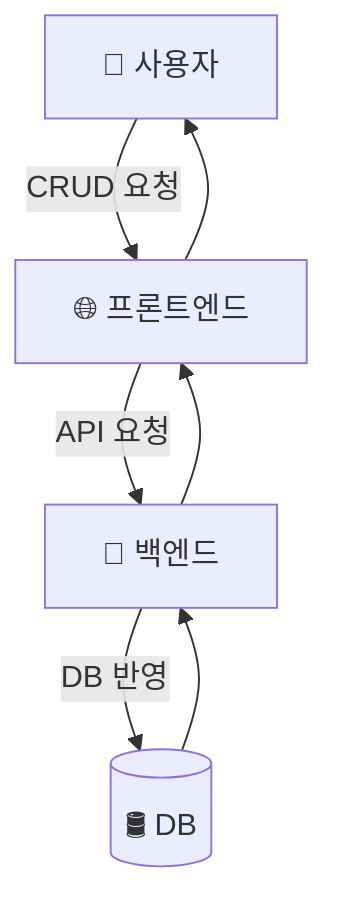

### 4. 시퀀스 다이어그램
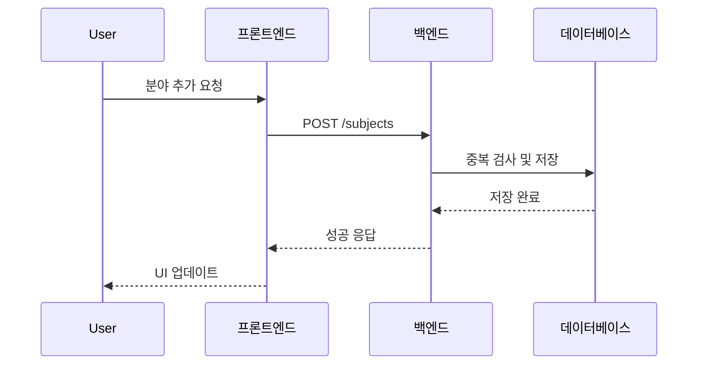

### 5. 핵심 보안 요구사항
| 항목 | 내용 | 필수 구현 사항 |
|---|---|---|
| 인증 및 인가 | 로그인된 사용자만 접근 가능 | - JWT 기반 인증<br>- 본인 소유 데이터만 CRUD 가능 |
| 입력값 검증 | 잘못된 입력값 방지 | - 이름 길이 제한(최대 100자)<br>- SQL Injection 방지 |
| 전송 보안 | 통신 암호화 | - HTTPS/TLS 적용 |

---

## F-03 노트 관리

### 1. 개요
- TipTap 기반 노트 작성/수정/삭제 기능

### 2. 주요 기능 및 개발 항목
- [T-17-F] 에디터 구현
- [T-18-B] CRUD API
- [T-19-F] 수동 저장
- [T-20-F] 미리보기
- [T-21-F] 리스트 및 정렬
- [T-22-F] 실시간 저장(추후)

### 3. 데이터 흐름 (DFD)
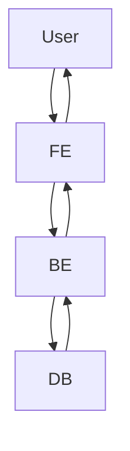

### 4. 시퀀스 다이어그램
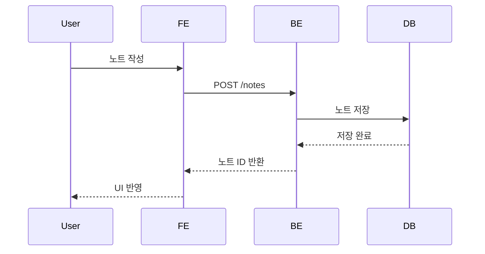

### 5. 핵심 보안 요구사항
| 항목 | 내용 | 필수 구현 사항 |
|---|---|---|
| 인증/인가 | 본인만 노트 접근 가능 | JWT 검증 + 사용자 ID 매칭 |
| 데이터 무결성 | 잘못된 HTML/스크립트 방지 | XSS 필터링 적용 |
| 전송 보안 | 데이터 암호화 | HTTPS 필수 |

---

## F-04 문제 생성/풀이

### 1. 개요
- 사용자 생성 문제 풀기 및 LLM 채점

### 2. 주요 기능
- [T-23-F] 문제 생성 UI
- [T-24-B] CRUD API
- [T-25-F] 풀이 팝업
- [T-26-B] LLM 채점
- [T-27-B] 결과 저장
- [T-28-B] 오답 자동 저장

### 3. DFD
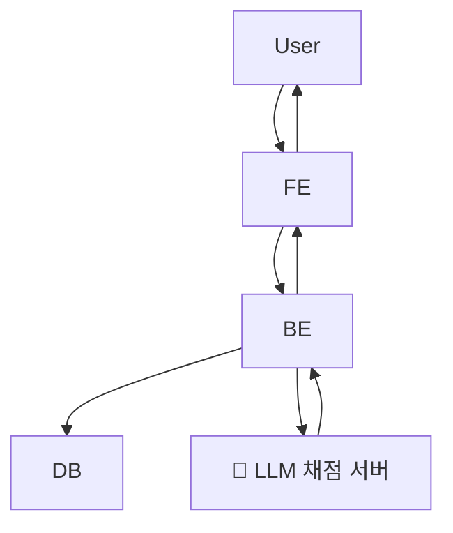

### 4. 시퀀스 다이어그램
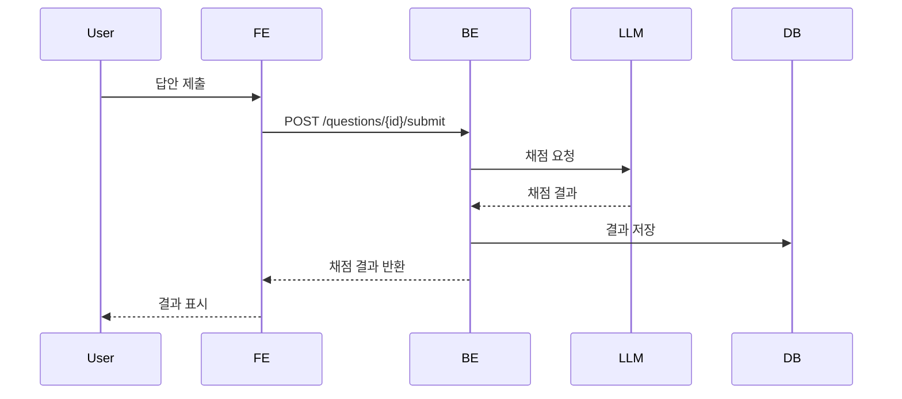

### 5. 핵심 보안 요구사항
| 항목 | 내용 | 필수 구현 사항 |
|---|---|---|
| 인증/인가 | 문제 데이터 접근 제한 | JWT 필수, 본인 문제만 수정 |
| 데이터 검증 | 입력값 유효성 | 문제 유형, 옵션 검증 |
| 외부 통신 보안 | LLM 통신 암호화 | HTTPS + API Key |

---

## F-05 오답노트 관리

### 1. 개요
- 틀린 문제/북마크 문제 관리

### 2. DFD


### 3. 시퀀스 다이어그램
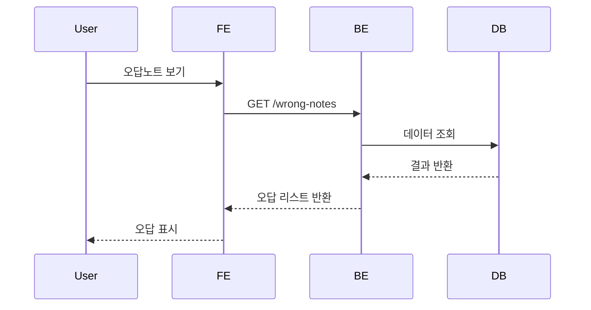

### 4. 핵심 보안 요구사항
| 항목 | 내용 | 필수 구현 사항 |
|---|---|---|
| 인증/인가 | 본인만 접근 가능 | JWT + 사용자 ID 매칭 |
| 데이터 보존 | 데이터 무결성 | 삭제/수정 시 권한 확인 |
| 전송 보안 | HTTPS |

---

## F-06 암기 세션 모드

### 1. 개요
- 노트 기반 암기 카드 학습

### 2. DFD


### 3. 시퀀스 다이어그램
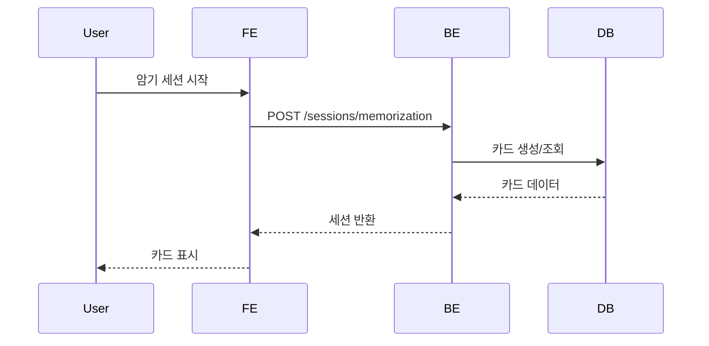

### 4. 핵심 보안 요구사항
| 항목 | 내용 | 필수 구현 사항 |
|---|---|---|
| 인증 | 로그인 사용자만 사용 | JWT 필요 |
| 데이터 검증 | 세션/카드 ID 검증 | 잘못된 ID 접근 차단 |
| 전송 보안 | HTTPS |

---

## F-07 학습 캘린더

### 1. 개요
- 사용자가 일별 학습 목표를 설정하고 달성 여부를 추적할 수 있는 기능입니다.
- 학습 기록과 연동하여 시각적인 피드백을 제공합니다.

### 2. 주요 기능 및 개발 항목
- [T-37-F] 날짜별 목표 입력 UI ⭐ High
- [T-38-B] 목표 상태 저장 및 미체크 → 미완료 처리 ⭐ Medium
- [T-39-F] 과거 목표 수정 가능 처리 ⭐ Medium
- [T-40-F] 반복 일정 기능 (추후 고려) ⭐ Low

### 3. 데이터 흐름 (DFD)
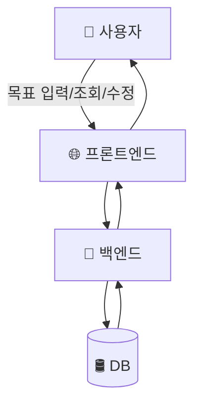

### 4. 시퀀스 다이어그램
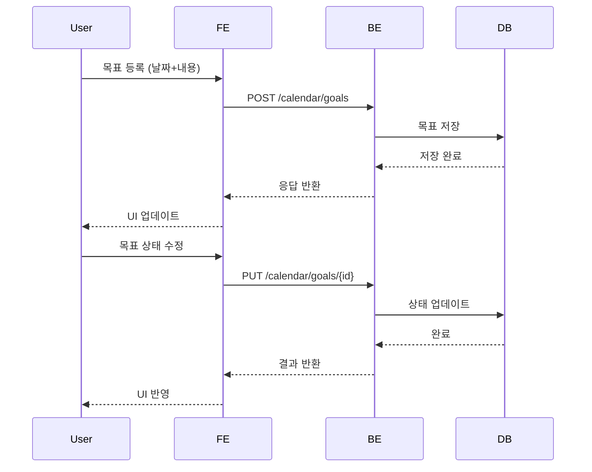

### 5. 핵심 보안 요구사항
| 항목 | 내용 | 필수 구현 사항 |
|---|---|---|
| 인증/인가 | 본인 목표만 접근 가능 | JWT 인증 + 사용자 ID 매칭 |
| 데이터 검증 | 날짜/내용 검증 | 날짜 형식 YYYY-MM-DD, 내용 길이 제한 |
| 데이터 무결성 | 수정/삭제 권한 확인 | 본인 데이터만 수정 가능 |
| 전송 보안 | HTTPS 적용 | 모든 API 암호화 |
