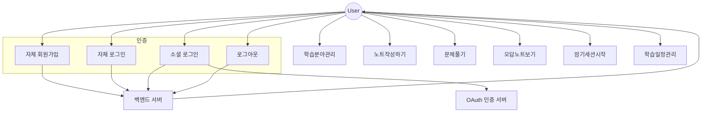

# 📘 유스케이스 다이어그램 및 시나리오 (상세화 버전)

---

## ✅ 유스케이스 다이어그램 (Mermaid)

---

## ✅ 유스케이스 시나리오 상세

### F-01 로그인 및 인증

#### 유스케이스: 자체 회원가입
- **액터**: 비로그인 사용자  
- **사전조건**: 없음  
- **후조건**: 사용자 계정이 DB에 저장됨  
- **기본 흐름**:  
  1. 사용자가 회원가입 페이지 진입  
  2. 이메일, 비밀번호, 닉네임 입력  
  3. 저장 클릭 시 서버에 `POST /auth/register` 요청  
  4. 서버가 중복 여부 확인 후 저장  
  5. `00000` 응답 반환  
  6. UI가 로그인 페이지로 이동 안내  
- **예외 흐름**:  
  - 입력 오류 → `40003` 반환 → UI에 “잘못된 입력값” 표시  
  - 중복된 이메일/닉네임 → `43001` 반환 → “이미 존재하는 사용자” 표시  

#### 유스케이스: 자체 로그인
- **액터**: 가입된 사용자  
- **사전조건**: 회원가입 완료  
- **후조건**: JWT 발급 및 클라이언트 저장  
- **기본 흐름**:  
  1. 사용자가 로그인 페이지 진입  
  2. 이메일/비밀번호 입력 후 제출  
  3. 서버에 `POST /auth/login` 요청  
  4. 서버 검증 후 JWT 발급  
  5. `00000` 응답과 함께 Access/Refresh Token 반환  
  6. UI가 메인 화면으로 이동  
- **예외 흐름**:  
  - 잘못된 인증 정보 → `41004` → “아이디/비밀번호 확인” 표시  
  - 비활성화 계정 → `43003` → “비활성화된 계정” 안내  

#### 유스케이스: 소셜 로그인
- **액터**: 사용자  
- **사전조건**: 소셜 계정 보유  
- **후조건**: JWT 발급  
- **기본 흐름**:  
  1. 사용자가 “구글/네이버/카카오 로그인” 클릭  
  2. 소셜 인증 서버에서 인증 후 액세스 토큰 반환  
  3. 프론트엔드가 `POST /auth/social-login` 요청  
  4. 서버가 토큰 검증 및 신규 계정 저장  
  5. `00000` 응답과 함께 JWT 반환  
  6. UI가 메인 페이지로 이동  
- **예외 흐름**:  
  - 잘못된 토큰 → `41004` → “유효하지 않은 인증” 표시  

#### 유스케이스: 로그아웃
- **액터**: 로그인 사용자  
- **사전조건**: 로그인 상태  
- **후조건**: Refresh Token 무효화  
- **기본 흐름**:  
  1. 사용자가 로그아웃 버튼 클릭  
  2. 서버에 `POST /auth/logout` 요청  
  3. 서버가 토큰 무효화  
  4. `00000` 응답 반환  
  5. UI가 로그인 화면으로 이동  

---

### F-02 학습 분야 관리

#### 유스케이스: 분야 추가
- **액터**: 로그인 사용자  
- **사전조건**: 로그인 상태  
- **후조건**: 새로운 학습 분야가 목록에 추가됨  
- **기본 흐름**:  
  1. 사용자가 “분야 추가” 버튼 클릭  
  2. 시스템이 입력창 표시 → 사용자 이름 입력  
  3. 저장 클릭 시 서버에 `POST /subjects` 요청  
  4. 서버 DB 저장 후 `00000` 응답 반환  
  5. UI에 새 분야 표시  
- **예외 흐름**:  
  - 빈 값 입력 → UI에 “필수 입력값” 경고 표시  
  - 중복된 이름 → `43001` 반환 → UI에 “이미 존재” 표시  

#### 유스케이스: 분야 수정
- **액터**: 로그인 사용자  
- **기본 흐름**:  
  1. 사용자가 특정 분야 선택 후 “수정” 클릭  
  2. 팝업창에서 이름 수정 후 저장  
  3. 서버에 `PUT /subjects/{id}` 요청  
  4. DB 업데이트 후 `00000` 응답  
  5. UI에 수정된 이름 반영  
- **예외 흐름**:  
  - 없는 ID → `43002` → “존재하지 않는 데이터” 표시  

#### 유스케이스: 분야 삭제
- **액터**: 로그인 사용자  
- **기본 흐름**:  
  1. 사용자가 특정 분야 선택 후 “삭제” 클릭  
  2. 시스템이 확인 팝업 표시 (하위 노트 삭제 여부 안내 포함)  
  3. 확인 시 `DELETE /subjects/{id}` 요청  
  4. 서버 DB 반영 후 `00000` 응답  
  5. UI에서 해당 분야 제거  
- **예외 흐름**:  
  - 없는 ID → `43002` → “이미 삭제된 데이터” 표시  

---

### F-03 노트 관리

#### 유스케이스: 노트 생성
- **액터**: 로그인 사용자  
- **기본 흐름**:  
  1. 사용자가 특정 분야 선택 후 “노트 추가” 클릭  
  2. 시스템이 에디터 표시  
  3. 내용 작성 후 저장  
  4. 서버에 `POST /notes` 요청  
  5. DB 저장 후 `00000` 응답  
  6. UI에 노트 추가됨  
- **예외 흐름**:  
  - 접근 권한 없음 → `41003`  
  - 없는 분야 ID → `43002`  

#### 유스케이스: 노트 조회/수정/삭제
- **기본 흐름**:  
  - 조회: 노트 클릭 → 서버 조회 → 내용 표시  
  - 수정: 수정 후 저장 클릭 → `PUT /notes/{id}` 요청 → `00000` 응답 → UI 갱신  
  - 삭제: 삭제 클릭 → 팝업 확인 → `DELETE /notes/{id}` 요청 → `00000` 응답 → UI 제거  

---

### F-04 문제 생성 및 풀이

#### 유스케이스: 문제 생성
- **액터**: 로그인 사용자  
- **기본 흐름**:  
  1. 사용자가 노트/분야에서 “문제 만들기” 선택  
  2. 문제 작성 후 저장  
  3. 서버에 `POST /questions` 요청  
  4. DB 저장 후 `00000` 응답  
- **예외 흐름**:  
  - 입력 오류 → `40003`  

#### 유스케이스: 문제 풀이 제출
- **기본 흐름**:  
  1. 사용자가 문제 풀기 클릭  
  2. 답안 작성 후 제출  
  3. 서버가 `POST /questions/{id}/submit` 요청 처리  
  4. LLM 채점 → 점수 계산  
  5. `00000` 응답과 점수 반환  
  6. UI에 결과 표시 및 오답 저장  
- **예외 흐름**:  
  - 없는 문제 ID → `43002`  
  - 채점 서버 오류 → `50001`  

---

### F-05 오답노트 관리

#### 유스케이스: 오답노트 조회
- **액터**: 로그인 사용자  
- **기본 흐름**:  
  1. 사용자가 “오답노트” 메뉴 클릭  
  2. 서버에 `GET /wrong-notes` 요청  
  3. DB 조회 후 `00000` 응답  
  4. UI에 오답 리스트 표시  
- **예외 흐름**:  
  - 권한 없음 → `41003`  

---

### F-06 암기 세션 모드

#### 유스케이스: 암기 세션 시작
- **액터**: 로그인 사용자  
- **기본 흐름**:  
  1. 사용자가 “암기 세션 시작” 클릭  
  2. 서버에 `POST /sessions/memorization` 요청  
  3. 서버가 카드 목록 생성 후 `00000` 응답  
  4. UI에서 암기 카드 표시  
- **예외 흐름**:  
  - 잘못된 요청 → `40003`  

---

### F-07 학습 캘린더

#### 유스케이스: 목표 등록
- **액터**: 로그인 사용자  
- **기본 흐름**:  
  1. 사용자가 “목표 추가” 클릭  
  2. 일정/내용 입력 후 저장  
  3. 서버에 `POST /calendar/goals` 요청  
  4. DB 저장 후 `00000` 응답  
  5. UI에 목표 표시  

#### 유스케이스: 목표 수정
- **기본 흐름**:  
  1. 사용자가 목표 클릭 후 수정 선택  
  2. 팝업에서 내용 변경 후 저장  
  3. 서버에 `PUT /calendar/goals/{id}` 요청  
  4. DB 업데이트 후 `00000` 응답  
  5. UI 갱신  
- **예외 흐름**:  
  - 없는 목표 ID → `43002`  

#### 유스케이스: 목표 조회
- **기본 흐름**:  
  1. 사용자가 캘린더 화면 진입  
  2. 서버에 `GET /calendar/goals` 요청  
  3. DB 조회 후 `00000` 응답  
  4. UI에 일정 표시  
