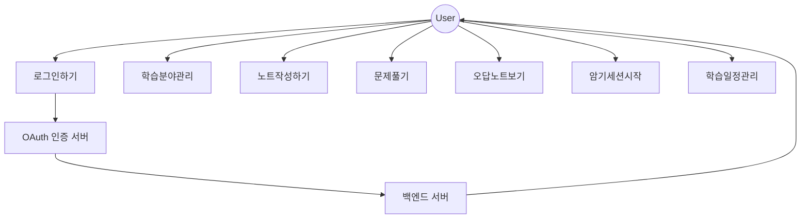

# 📘 유스케이스 다이어그램 및 시나리오 (기능정의서 기반)

---

## ✅ 유스케이스 다이어그램 (Mermaid)

---

## ✅ 유스케이스 시나리오 정리

### 1. 소셜 로그인 하기 (F-01)

- **액터**: 사용자
- **사전조건**: 소셜 계정 보유 (Google, Naver, Kakao)
- **후조건**: JWT 토큰이 발급되어 저장됨
- **기본 흐름**:
  1. 사용자가 소셜 로그인 버튼 클릭
  2. OAuth 인증 수행 (팝업/리다이렉트)
  3. 액세스 토큰 획득 → 백엔드 전달
  4. 백엔드가 사용자 정보 조회 → JWT 발급
  5. 클라이언트에 저장 후 메인 페이지로 이동
- **예외 흐름**:
  - 인증 실패 시 → 에러 메시지 표시
  - 네트워크 오류 → 재시도 유도

---

### 2. 학습 분야 관리 (F-02)

- **유스케이스**: 분야 추가 / 수정 / 삭제
- **액터**: 사용자
- **기본 흐름**:
  1. 분야 추가 클릭 → 이름 입력 → 저장
  2. 수정/삭제 클릭 → 팝업 확인 → 반영
- **예외 흐름**:
  - 중복 이름 → 경고 표시
  - 삭제 시 하위 노트 삭제 여부 확인

---

### 3. 노트 작성 및 관리 (F-03)

- **유스케이스**: 노트 작성 / 수정 / 저장
- **액터**: 사용자
- **기본 흐름**:
  1. 분야 선택 → "노트 추가" 클릭
  2. 에디터에 내용 입력 (텍스트, 리스트 등)
  3. 저장 버튼 클릭 → 서버로 저장
- **후속 흐름**:
  - 노트 리스트에 추가됨
  - 클릭 시 수정 진입 가능

---

### 4. 문제 생성 및 풀이 (F-04)

- **유스케이스**: 문제 작성 / 문제 풀이 / 채점 결과 확인
- **액터**: 사용자
- **기본 흐름**:
  1. 분야 선택 → "문제 추가" 클릭
  2. 문제 유형 선택 (객관식, 주관식, 단답형)
  3. 내용 입력 및 저장
  4. 문제 풀이 세션 시작 → 문제 화면 진입
  5. 객관식: 선택 즉시 평가 / 주관식: LLM 채점 요청
- **예외 흐름**:
  - 서버 오류 시 재시도 메시지 표시

---

### 5. 오답노트 관리 (F-05)

- **유스케이스**: 오답 보기 / 북마크 관리 / 다시 풀기
- **액터**: 사용자
- **기본 흐름**:
  1. 오답노트 진입 → 필터 선택 (틀린 문제 / 북마크)
  2. 문제 상세 보기 → 해설 및 평가 확인
  3. 다시 풀기 클릭 → 재풀이 세션

---

### 6. 암기 세션 모드 (F-06)

- **유스케이스**: 암기 세션 시작 / 암기 여부 판단
- **액터**: 사용자
- **기본 흐름**:
  1. 노트/분야 선택 → 세션 시작
  2. 카드 앞면/뒷면 확인 → "암기했음" 또는 "기억 안 남" 클릭
  3. 결과 저장 → 복습 목록 구성

---

### 7. 학습 일정 관리 (F-07)

- **유스케이스**: 목표 입력 / 완료 체크 / 미완료 처리
- **액터**: 사용자
- **기본 흐름**:
  1. 캘린더에서 날짜 선택
  2. 목표 입력
  3. 체크 시 완료 처리 / 미체크 시 자동 미완료 처리
  4. 지난 일정도 수정 가능

